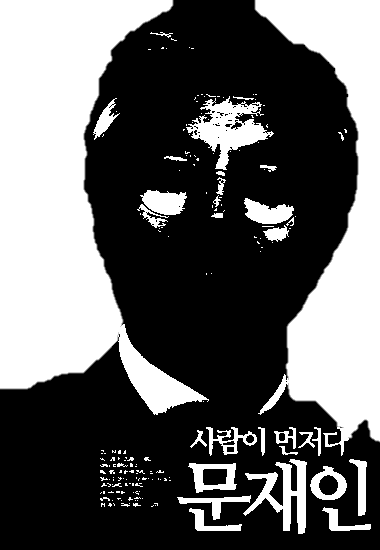
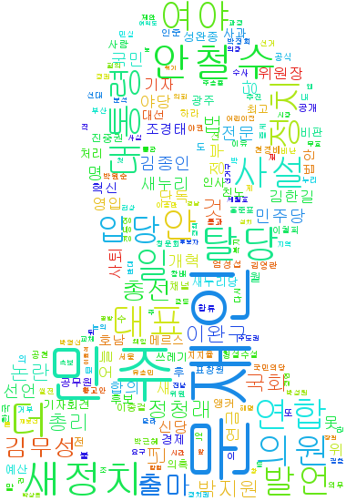

# 워드클라우딩
## 개요
고려대학교 통계학과 동아리였던 빅데이터연구회(요즘 이름이 바뀐거 같습니다..)에서 활동할 때 방학세션때 잠시 했던거네요.

연세대학교 ESC였나 통계동아리랑 같이 조인해서 세션 가졌습니다.

2016년 2월 2일이 마지막 수정일자였는데, 아마 총선때를 대비해서 신문사별로 어떻게 새누리당(현재 자유한국당)과 더불어민주당을 다루는 지를 워드 클라우딩을 통해 보여주려고 했을겁니다.
하드를 뒤지다 찾은 정리안된 코드 중에서 알아볼수 있는 것만 몇개 뽑아서 업로드 합니다.

## 코드 설명
exam.py가 아마 뉴스를 무식하게 크롤링 했던 파일일겁니다. 결과물을 보니 기사 제목만 따온거 같네요.
대충봐도 저런식으로 하면 밴먹습니다. 아마 exam이라고 된걸보니 실제로 크롤링했던 코드가 따로 있을듯 합니다.

Konlpy_exam.py가 단어를 형태소대로 tokenized했던 파일입니다. 요즘은 모르겠는데 당시에 konlpy가 컴퓨터 환경마다 되는 컴퓨터가 있고 잘 설치안되는 컴퓨터가 있어서 팀플이 전혀 안되었던게 생각나네요.

wordclouding은 이미지 모양대로 워드크라우딩을 한 것입니다.

## 결과

컬러 이미지에서 흑백으로 변환 한 이미지에서

이런 워드클라우딩이 나옵니다.

언론사별로 데이터를 수집하여 각 이미지를 출력 하였고, 발표자가 주관적인 해석을 달아서 발표를 한걸로 기억나는데,, 찾지 못하였습니다.

더불어민주당은 문재인, 새누리당은 김무성 당시 대표 이미지 위에 워드클라우딩을 해서 비교하며 발표한걸로 기억합니다.